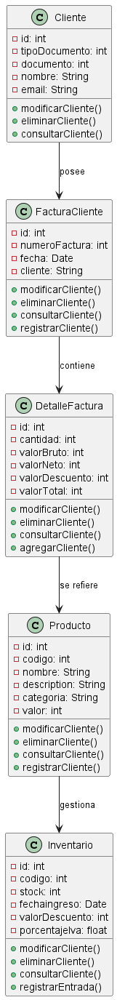
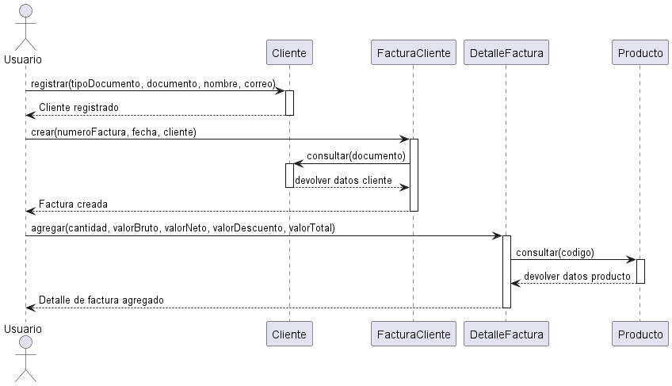

# Parcial3corte Analisis de Sitemas

* 
1. RF1:
* Registro de Clientes
-El sistema debe permitir a los usuarios registrarse proporcionando información básica como tipoDocumento, nombre, documento y correo electrónico.
-Debe permitir modificar y eliminar los datos.
-Debe permitit consultar cada cliente usando el documento como identificador.

Ver aqui 

ver aqui 

ver aqui 